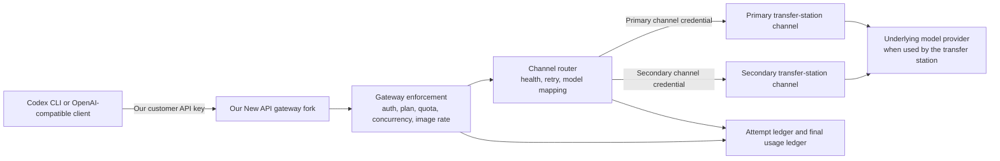
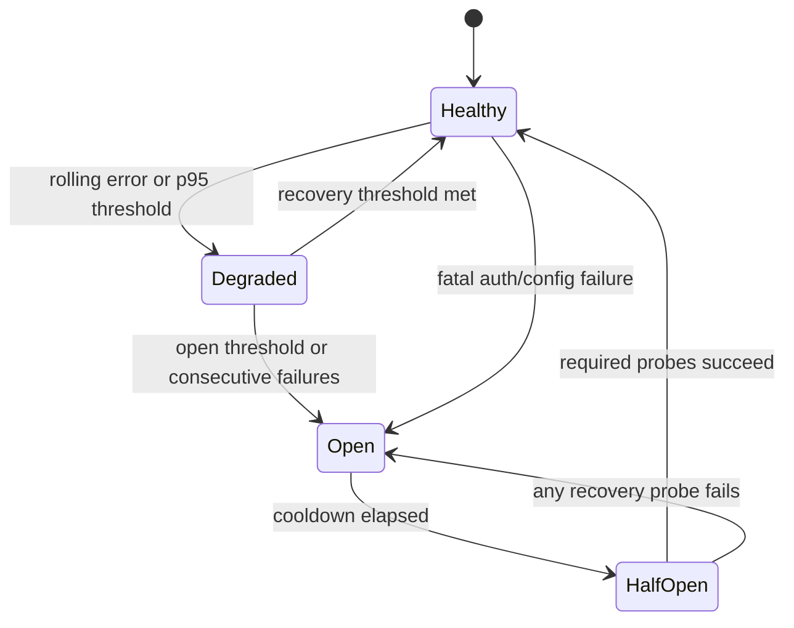

# Channel and Codex Compatibility Design

- **Status:** Approved for implementation planning
- **Date:** 2026-07-30
- **Decision owner:** Platform owner
- **Foundation:** `QuantumNous/new-api` at commit `66ee6b8f9889050ffef1f863a4314ce4a0516fb9`
- **Codex contract target:** CLI `0.146.0`, source commit `e363b08c9175ac1cbe5893615dd2cb9ddf95043b`
**Scope:** Authoritative channel architecture and Codex compatibility boundary
- **Current execution selector:** `docs/plans/2026-07-31-commercial-mvp.md`

> **Commercial MVP rescope (2026-07-31):** This design remains authoritative for channel,
> security, and Codex wire-compatibility invariants. Historical references to “Step 1” and later
> step allocation no longer define the current delivery sequence. The commercial MVP plan selects
> the smallest launch subset and preserves unselected controls in the future hardening roadmap.
> For this private single-replica MVP only, the characterized and minimally extended native
> `SubscriptionPreConsumeRecord` transaction is the sole PostgreSQL request-quota reservation
> owner; the separate `customer_usage_reservations` design is deferred unless characterization
> fails and the plan returns for approval. Redis recovery is closed/drained and operator-initiated
> under a PostgreSQL enforcement epoch; transparent reconstruction of live leases/image admissions
> remains future hardening. These selections replace the conflicting storage/rebuild details below
> for the current MVP without changing the durable-authority or fail-closed invariants.

> **Current private-MVP channel amendment (2026-08-18):** The private MVP activates one
> configured transfer-station channel only. Each logical request makes one upstream attempt
> (`RetryTimes=0`); automatic channel retry, secondary selection, concurrent failover, and any
> provider-redundancy claim are deferred to future hardening. Commitment fencing, single-attempt
> usage/cost accounting, rolling health, sanitized errors, and fail-closed outage behavior remain
> required. The multi-channel routing/failover material below remains a future architecture
> reference and does not gate the current private release.

## 1. Decision

Build a thin, upstream-tracking fork of New API. New API remains the single customer-facing
authentication, entitlement, enforcement, routing, usage, and audit boundary.

The product topology is:



Customers authenticate only with keys issued by this platform. The gateway replaces that
credential with the selected channel's credential before making an upstream request. A reseller
or transfer station is simply a configured channel; it is not embedded in core logic. Customers
never receive or use the transfer station's credential and never bypass this gateway. The
transfer station may itself relay to a model provider; that downstream topology is outside the
customer contract.

This matches Kadirr's observable customer model:

1. A customer configures Codex with a Responses-compatible base URL.
2. The customer supplies a platform-issued API key.
3. The platform advertises account/package-based access and usage limits.
4. AI request data may be routed to one or more undisclosed third-party model providers,
   depending on the integration and provider configuration.

It does not assume knowledge of Kadirr's private routing, suppliers, failover, costs, or
infrastructure. Public compatibility is a contract; private implementation claims would be
guesswork.

## 2. Why a Thin Fork

New API already supplies the correct foundation:

- Database-backed channels with name, base URL, key, adaptor, models, model mapping, group,
  priority, weight, and status.
- Customer tokens, users, groups, subscriptions, quota accounting, and consume logs.
- OpenAI-compatible relay adaptors, including the Responses API.
- Priority-based retries and weighted selection.
- Replayable request bodies.

Configuration alone does not meet the requirements:

- A retry can reselect a previously attempted channel.
- HTTP `504` and `524` are currently non-retryable.
- There is no per-channel header or first-semantic-event deadline.
- There is no rolling channel error rate or latency percentile.
- Streaming output is committed before safe cross-channel recovery is assured.
- Channel credentials are stored as literal values instead of secret references.
- Customer API keys are stored in recoverable form in the native token table.
- Customer selling price is not a channel-specific upstream cost ledger.
- The final consume log is not a normalized record of every upstream attempt.

An external routing sidecar was rejected because it would create two routing authorities. The
gateway could no longer reliably identify the actual upstream attempt, cost, or failure that
produced a customer response.

## 3. Scope and Non-Goals

### In scope

- Named, configurable upstream channels.
- One active named channel for the current private MVP; additional channels are future hardening.
- Forward and reverse model alias mapping.
- Customer API key issuance tied to versioned plan entitlements.
- OpenAI Responses compatibility for Codex CLI.
- Single-attempt routing and downstream commitment fencing; request-scoped failover is future
  hardening only.
- Rolling channel health and fail-closed unavailability; runtime deprioritization is future
  hardening.
- Separate upstream-attempt and customer-usage ledgers.
- Secret references resolved only at runtime.
- Security boundaries that all direct API calls traverse.

### Not in Step 1

- Stripe checkout and webhook processing.
- Production quota, concurrency, and image limiter implementation.
- A customer dashboard or custom billing UI.
- Responses background jobs, CRUD endpoints, or Responses-over-WebSocket.
- Supporting OAuth refresh, AWS SigV4, or arbitrary executable authentication templates.
- Claiming true provider redundancy when two channels share a transfer station or failure domain.

The later items remain requirements for their specified build checkpoints. The Step 1 data model
must support them without redesign.

## 4. Public Codex Contract

### 4.1 Routes

The canonical API routes are:

- `POST /v1/responses`
- `POST /v1/responses/compact`
- `GET /v1/models` and `GET /v1/models/{public-alias}`, filtered by the key's plan

Kadirr documents an origin-only Codex `base_url` and separately demonstrates a direct
`/v1/responses` curl. Codex CLI `0.146.0` constructs its Responses URL by appending `responses` to
the configured base. Supporting the documented origin-only configuration shape therefore requires
the same handlers to serve:

- `POST /responses`
- `POST /responses/compact`
- `GET /models` and `GET /models/{public-alias}`

These aliases are a conclusion from the pinned Codex client's URL construction, not a claim that
Kadirr publicly documents either root route. They are not redirects. Alias middleware records the
original customer path, then canonicalizes it to the internal endpoint class
`responses.create`, `responses.compact`, `models.list`, or `models.retrieve` before
relay/controller selection. The selected channel's `capability_config` then supplies its
configured outbound path; `/v1/responses` is an editable seed value, not core routing logic.
Both public route forms therefore enter the same authentication, validation, enforcement,
routing, and audit chain and reach the transfer station at that channel's configured path. Adding
another Gin route alone is insufficient because native New API derives relay behavior from the
incoming path.

The customer-facing router is deny-by-default. Step 1 enables only the routes above plus a
credential-free liveness endpoint that exposes no dependency or configuration detail. Native
chat, image, task, vendor-specific, realtime/WebSocket, and alternate relay routes are not public
until a later checkpoint registers the exact method/path and proves enforcement parity. Step 2
may add the configured image endpoints only together with the independent image limiter.

Customer routes accept credentials only from `Authorization: Bearer`. Native alternatives such as
query `key`, `x-api-key`, `x-goog-api-key`, `mj-api-secret`, WebSocket query credentials, and
vendor-specific headers are disabled at the public boundary. Administrative routes use a
separate listener or network/role policy and cannot act as a customer relay.

### 4.2 Customer authentication

Every request uses:

```http
Authorization: Bearer <platform-issued-customer-key>
```

The customer key is removed before upstream dispatch. The selected channel's authentication
configuration injects its credential after routing.

The v1 key grammar is:

```text
sk-pxv1.<26-character Crockford-Base32 public ID>.<52-character Crockford-Base32 secret>
```

The public ID is the canonical unpadded Crockford-Base32 encoding of 16 CSPRNG bytes; the secret
is the canonical encoding of 32 CSPRNG bytes. Both are uppercase. Decoding must yield exactly 16
or 32 bytes and reject noncanonical trailing pad bits, ambiguous aliases, and alternate textual
encodings. The resulting components therefore carry exactly 128 and 256 random bits. A unique
index looks up the public ID, then the gateway verifies:

```text
HMAC-SHA-256(pepper[pepper_version], "pxv1." || public_id || "." || secret)
```

in constant time. The database stores only public ID, verifier, pepper version, status, customer
ID, stable subscription ID, optional scope ceiling, creation/expiry/last-used times, and audit
metadata. The active plan is resolved through the subscription at admission, so renewal or
upgrade does not require key replacement. Every admitted request snapshots the exact plan version
used for enforcement and settlement.

Issuance displays the full key once. Rotation creates a new public ID/secret and may provide a
short audited overlap; both keys share the same subscription limits. Redis keys use a separate
keyed digest and never the raw bearer value. Administrative search uses public ID or masked
prefix, never raw secret.

Pepper records reference versioned environment/secret-manager values. Verification retains the
old pepper during a defined rotation window; a successfully used old key is re-HMACed with
the active pepper inside a compare-and-set update. Dormant keys must be rotated or revoked before
their old pepper can be removed.

Native New API authentication cannot remain alongside this path: it strips `sk-`, truncates at a
hyphen, performs plaintext database lookup, and caches around the raw token. The fork replaces
normal and read-only token auth, issuance, lookup, Redis cache keys, quota/enforcement identity,
revocation, rotation, search, and administrative serialization. Because this is greenfield,
legacy plaintext customer tokens are not imported; startup fails if a production row contains
one. Raw customer keys are absent from database, Redis, logs, analytics, and admin responses.

### 4.3 Kadirr-shape compatibility mode

The platform supports Kadirr's observable provider/auth shape with our hostname and key. The
released snippet deliberately omits Kadirr's published
`network_access = "enabled"` line because that is not a valid top-level key in Codex CLI
`0.146.0`. Provider HTTP access does not require it. Sandbox network permission, when separately
needed, uses Codex's current `[sandbox_workspace_write] network_access = true` setting.

```toml
model_provider = "OpenAI"
model = "gpt-5.6-sol"
review_model = "gpt-5.6-sol"
model_reasoning_effort = "xhigh"
disable_response_storage = true

[model_providers.OpenAI]
name = "OpenAI"
base_url = "https://api.example.com"
wire_api = "responses"
requires_openai_auth = true
supports_websockets = false
supports_standalone_web_search = false
request_max_retries = 0
stream_max_retries = 0
```

Kadirr's page also enables `[features] goals = true`; this is valid but currently redundant and
is not part of the gateway contract.

In this compatibility mode, Codex's managed `auth.json` record supplies the platform-issued key
under `OPENAI_API_KEY`:

```json
{
  "OPENAI_API_KEY": "PLATFORM_ISSUED_KEY"
}
```

This mode exists for low-friction migration. The platform never programmatically replaces the
whole `auth.json` file because it may contain an existing ChatGPT session. Customers use a
dedicated `CODEX_HOME`/profile or Codex's supported API-key login flow, and documentation warns
them never to commit, share, screenshot, or send the file to support.

### 4.4 Recommended environment-key Codex mode

The recommended configuration uses a platform-specific provider ID and an environment variable
instead of placing the customer key in Codex's shared OpenAI authentication record:

```toml
model_provider = "our_platform"
model = "gpt-5.6-sol"
review_model = "gpt-5.6-sol"
model_reasoning_effort = "xhigh"
disable_response_storage = true

[model_providers.our_platform]
name = "OpenAI"
base_url = "https://api.example.com/v1"
wire_api = "responses"
env_key = "OUR_PLATFORM_API_KEY"
supports_websockets = false
supports_standalone_web_search = false
request_max_retries = 0
stream_max_retries = 0
```

The display `name` remains `OpenAI` because the reviewed Codex client currently uses that value,
not only `wire_api`, to enable remote Responses compaction. The provider ID is still
`our_platform`, and the `/v1` route is canonical. A fully branded display name is not advertised
as feature-equivalent until that Codex coupling changes. The exact syntax is contract-tested
against the pinned Codex CLI version used for release.

Provider configuration belongs in the user-level `%USERPROFILE%\.codex\config.toml` on Windows
or `~/.codex/config.toml` on macOS/Linux. Current Codex does not honor custom provider definitions
from a repository-local `.codex/config.toml`. Provider IDs are case-sensitive:
`model_provider = "OpenAI"` must match `[model_providers.OpenAI]`, while the `name` field is a
display/capability value.

The released configurations make the gateway the sole automatic retry owner. Codex's retry counts
are set to zero, which still permits the original attempt. A customer may override those values,
but every additional inbound request is independently authenticated and audited; pre-commit
failures release reservations, while any request that committed useful output consumes its own
request unit. Automatic client retries are not silently deduplicated or advertised as free.

### 4.5 Codex release pin

The Step 1 release target is Codex CLI `0.146.0` (`rust-v0.146.0`), source commit
`e363b08c9175ac1cbe5893615dd2cb9ddf95043b`, published 2026-07-29. The Linux x86-64 contract-test
artifact is `codex-package-x86_64-unknown-linux-musl.tar.gz` with official SHA-256
`3c89125af1d7c98abec8beb551292ef99daca52e204e5852a9139feae2c467e5`.

At initial launch, the minimum-supported and latest-tested versions are both `0.146.0`. That
support claim becomes active only after the Step 1 suite records `codex --version`, artifact
checksum, source commit, and full contract results. Newer Codex versions require the same suite
before the latest-tested value changes; untagged `main` is evidence, not a release pin.

### 4.6 Model aliases

Public model names are platform aliases, not assertions about an upstream vendor's official model
IDs. The initial editable catalog supports:

- `gpt-5.6-sol`
- `gpt-5.6-terra`
- `gpt-5.6-luna`
- `gpt-5.5`
- `gpt-5.4`
- `gpt-image-2`, the editable launch alias for the source specification's GPT-2 Image /
  GPT-Image-2 label

Each channel maps a public alias to its own upstream model slug. Entitlement checks always use the
public alias before mapping. Responses, SSE events, headers, and sanitized errors are
reverse-mapped so an upstream slug is never exposed to the customer. Reverse mapping uses the
request-scoped public alias, not a global inverse map, because two public aliases may legitimately
target the same upstream slug.

No public alias or upstream model mapping is hardcoded into routing logic. Seed records are
editable database configuration.

### 4.7 Request and response behavior

The Responses façade preserves the fields used by current Codex turns, including:

- `model`, `instructions`, `input`, `tools`, and `tool_choice`;
- `parallel_tool_calls`, `reasoning`, `store`, and `stream`;
- `stream_options`, `include`, `service_tier`, and `prompt_cache_key`;
- `text` and `client_metadata`.

Request fields have three explicit classes:

- supported allowlisted fields are validated and forwarded;
- known but unsupported fields, including Responses `background`, return HTTP `400`
  `invalid_request_error` with the offending `param`;
- unknown fields return the same `400` unless a versioned compatibility extension explicitly
  allows that field for the tested client/channel contract.

Documented extensible containers such as metadata and tool schemas remain opaque customer data
after size/depth validation. This prevents silent field loss and prevents unreviewed fields from
becoming control-plane input. Native New API's typed reserialization silently drops some fields,
so explicit rejection is a required fork change. `service_tier` is forwarded only when both the
plan and selected channel enable it. Fast mode is not advertised until this is tested.

Neither native New API request mode is sufficient: typed reserialization can discard fields,
while raw pass-through can forward the unmapped public model and bypass field policy. The fork
uses one transformation pipeline:

1. retain the bounded raw JSON object;
2. validate it against the versioned route schema;
3. preserve only allowed fields and validated opaque containers;
4. replace the public model alias with the selected channel's upstream slug;
5. apply deterministic plan/channel filtering and overrides;
6. serialize the resulting object for the upstream adaptor.

Native Responses pass-through is disabled. `/responses/compact` uses its own smaller schema and
transformation policy; it is not processed as an ordinary Responses request. Step 1 accepts only
stateless `store: false` (or omitted with an enforced false default). `store: true` is a known
unsupported field value and returns `400` until stored-response affinity and idempotency are
designed.

Responses use OpenAI-shaped JSON and SSE. Function-call events, `function_call_output`, reasoning
events, encrypted reasoning content requested through `include`, and turn-state metadata must
round-trip without semantic conversion.

Response rewriting is schema-directed, never a global string replacement. Only explicit model
fields are changed to the request-scoped public alias. Protocol identifiers—including response,
item, message, function-call, and tool-call IDs—are preserved exactly because later
`function_call_output` items refer to them.

Request headers use a closed allowlist:

| Header | Gateway behavior |
|---|---|
| `Authorization` | Consume customer credential, strip it, then inject channel auth |
| `session-id`, `thread-id`, `x-client-request-id` | Validate length/characters, then replace with stable platform-scoped HMAC pseudonyms before upstream |
| `x-openai-subagent` | Validate as a bounded header token and forward |
| `X-Codex-Turn-State` | Validate size/encoding, forward as opaque data, never log |
| `Content-Type`, supported `Content-Encoding`, `Accept` | Validate against the endpoint contract |

Credentials, cookies, proxy/forwarding headers, hop-by-hop headers, and all other customer headers
are stripped. Response headers also use a closed contract:

| Header | Gateway behavior |
|---|---|
| `x-request-id` | Return the platform request ID; retain upstream request ID internally |
| `openai-model`, `x-openai-model` | Return the request-scoped public model alias |
| `x-models-etag` | Return the platform model-catalog ETag, never the upstream catalog value |
| `x-ratelimit-*`, `Retry-After` | Return gateway plan/capacity values, not raw upstream limits |
| `X-Reasoning-Included`, `X-Codex-Turn-State` | Validate and preserve when present |

No request or response header family is wildcard-forwarded.

Step 1 strips upstream `x-ratelimit-*` and emits none because Step 2 does not yet own authoritative
gateway counters. In Step 1, `Retry-After` appears only on a sanitized platform error. Step 2 may
emit gateway rate metadata only after its counter/lease state is authoritative and tested.

Every successful SSE stream contains exactly one terminal `response.completed` event with a
non-empty response ID and complete usage totals, including reasoning-token details when the
upstream reports that meter. EOF without `response.completed` is failure. `response.done` may be
normalized only inside a typed channel adaptor when its payload is provably equivalent and
contains complete usage; otherwise it is failure. Missing usage never becomes a successful
zero-cost settlement. If semantic output was already committed, the gateway emits a sanitized
`response.failed` with code `usage_not_included` and records unknown/estimated operator cost.

Sanitization preserves the HTTP status, retry classification, `Retry-After`, and standard codes
Codex uses for behavior: `context_length_exceeded`, `insufficient_quota`, `usage_not_included`,
`rate_limit_exceeded`, `server_is_overloaded`, `slow_down`, and `invalid_prompt`. Vendor prose,
hostnames, account IDs, model slugs, and credentials are removed.

### 4.8 Explicitly unsupported Codex features

Until separately designed and tested:

- `supports_websockets` is false.
- `supports_standalone_web_search` is false; `/v1/alpha/search` is not part of the initial public
  contract even though pinned New API contains a route.
- Responses background mode is rejected.
- Retrieve, cancel, delete, and input-item CRUD routes are not advertised.
- Multiline SSE `data:` frames are unsupported unless the parser is upgraded and contract-tested.

Normal Codex HTTP/SSE tool loops remain in scope.

## 5. Channel Abstraction

### 5.1 Canonical channel record

The native New API channel remains the routing authority. Existing fields are retained:

| Field | Meaning |
|---|---|
| `id`, `name`, `status` | Stable channel identity and operator enablement |
| `type` / adaptor | Wire-format adapter selected by configuration |
| `base_url` | Validated transfer-station or provider origin |
| `models` | Public aliases this channel can serve |
| `model_mapping` | Public alias to upstream slug mapping |
| `group` | New API ability/entitlement routing group |
| `priority` | Static operator preference |
| `weight` | Weighted selection inside an equivalent route tier |
| `setting`, `settings` | Existing native adaptor-specific JSON |
| `header_override`, `param_override` | Existing native request overrides, subject to validation |

The fork adds references, not embedded provider logic:

| Added field | Meaning |
|---|---|
| `secret_ref` | Runtime credential reference such as `env://UPSTREAM_PRIMARY_API_KEY` |
| `auth_config` | Typed, non-secret authentication scheme and injection location |
| `capability_config` | Typed endpoints, canonical paths, usage, streaming, storage, compression, and idempotency capabilities |
| `reliability_policy_set_id` | Versioned set of endpoint-class timeout, retry, and health policies |
| `cost_profile_version_id` | Immutable upstream cost-rate snapshot source |
| `failure_domain` | Operator label used to detect false redundancy |

The migration makes native `Channel.Key` nullable and rejects it for production-active channels.
Every adaptor, scheduled test, retry, image/task path, and administrative connectivity check
receives a request-scoped resolved credential; none reads `Channel.Key`. Administrative reads
return the secret reference and config revision, never a resolved value.

Production activation treats the legacy setting and override fields as typed, adaptor-specific
configuration rather than arbitrary escape hatches. It rejects:

- unknown setting/override keys or values outside the adaptor's non-secret schema;
- changes to `Authorization`, `Proxy-Authorization`, `Cookie`, the configured auth header/query
  name, or another credential-bearing location;
- `{api_key}`, secret references, interpolation syntax, or credential-shaped literal values
  anywhere outside `auth_config` and `secret_ref`.

Only `secret_ref` may supply authentication material. Neither an operator override nor a
customer-supplied field can replace, supplement, or expose it.

### 5.2 Structured authentication

Channel authentication is data, validated before activation:

- scheme: bearer, fixed header, query parameter, or none;
- credential placeholder: exactly `{api_key}`;
- header or query name;
- optional non-secret fixed headers;
- adaptor selection.

Header names and values reject control characters. Credential placeholders are allowed only in
the declared auth field. Query-auth credentials are redacted from URL logs, tracing attributes,
metrics, proxy access logs, and errors. Customers cannot submit or override channel auth
configuration.

OAuth refresh, SigV4, and bespoke signing require a typed adaptor or external secret broker. They
cannot be represented as arbitrary scripts or string interpolation.

### 5.3 Secret resolution

Step 1 supports `env://NAME`. The resolver:

1. validates the reference grammar;
2. resolves it at request scope into a short-lived in-memory value;
3. never writes the value back to the channel object, database, cache, trace, or error;
4. registers environment-backed values with the centralized redactor at process startup and
   secret-manager values before any possible log;
5. minimizes value lifetime and copies;
6. fails the channel attempt closed if resolution fails.

Go strings and process-environment values cannot be reliably zeroized, so the design does not
claim they can. Readiness compares non-reversible, keyed secret fingerprints across gateway
instances for the same channel/config revision. A mismatch makes that channel unavailable on the
inconsistent instance and alerts operators; it never prints either fingerprint or secret.

Later resolvers may support a secret manager through the same interface. In the current private
MVP, a missing channel secret fails the request closed; it can never cause an unauthenticated or
customer-authenticated upstream request. A future multi-channel deployment may select a valid
secondary under the routing rules in Section 6.

### 5.4 Initial channel pool

The current private MVP uses one active test/transfer-station channel. A second row may be kept
disabled for future failover characterization, but it is not part of the current release gate:

| Name | Priority | Weight | Secret reference | Failure domain |
|---|---:|---:|---|---|
| `transfer-primary` | 100 | 100 | `env://UPSTREAM_PRIMARY_API_KEY` | configured |

The active channel may target a controlled mock endpoint or the configured transfer station. A
second channel, if later enabled, must have an explicitly recorded failure domain; a second row
or shared supplier is not provider redundancy. Future Step 3 hardening may require independently
failing routes—different transfer station, region, account, or provider—as supported by the
commercial model.

Weight `0` is not used as a disable switch because native New API smooths zero weights back into
selection. Operator status and runtime health determine eligibility.

## 6. Routing and Failover (future hardening)

The rules in this section define the deferred multi-channel architecture. The current private
MVP performs a single validated channel attempt and returns a sanitized terminal error when that
attempt cannot complete; it does not execute the retry sequence below.

### 6.1 Request routing sequence

Every customer relay route executes the same sequence:

1. Assign an internal `request_id`; accept a valid client request ID only as metadata.
2. Perform the constant-bounded route, authentication-framing, declared-size, and encoding checks
   defined by Section 10.
3. Authenticate the hashed customer key and load the active subscription and immutable plan
   version.
4. Create the durable admission identity and acquire the fenced concurrency validation lease.
5. Read and decompress within hard bounds, then perform the expensive schema, model entitlement,
   reasoning, service-tier, and token validation while holding the lease.
6. Build eligible channels for the public alias and endpoint class.
7. Remove disabled, open, incompatible, and already-attempted channel IDs.
8. Prefer runtime-healthy routes, then static priority, then configured weight.
9. Resolve the selected channel secret and map the public alias.
10. Before the first upstream dispatch, reserve durable request/token quota and any image
    admission, and insert the pending identity for the selected attempt as specified in Sections
    8 and 10.
11. Execute the attempt with the selected reliability policy.
12. Finalize the attempt result and append its scoped health observation.
13. Retry only if the outcome and downstream commitment state permit it; insert each retry's
    pending attempt identity before dispatch and exclude every previously attempted channel ID.
14. Settle the logical customer request exactly once and release the concurrency lease.

The request-scoped attempted-channel set is authoritative. With `RetryTimes=1`, at most two
upstream attempts occur for one inbound HTTP request. The same channel cannot be selected twice
within that request.

Codex CLI has its own HTTP and stream retry policy, so one user turn can create multiple inbound
gateway requests and more than two total upstream attempts. `session-id`, `thread-id`, and
`x-client-request-id` are metadata, not safe idempotency keys, and are never used to deduplicate
blindly. Each inbound request gets a distinct platform `request_id`. Failed pre-commit requests
release their customer quota reservation; a request that commits useful output settles one
logical request unit even if Codex later retries the turn. Internal failover tests disable client
retries to isolate gateway behavior, while a separate pinned-client suite tests and reconciles
Codex's defaults.

### 6.2 Effective route order

Runtime health never overwrites configured priority or weight. Selection uses:

1. eligibility and endpoint/model capability;
2. runtime health rank;
3. static priority;
4. weighted choice among otherwise equivalent channels.

A healthy secondary outranks a degraded primary. An open channel is excluded. A half-open channel
accepts only a bounded recovery probe. This makes operator intent recover automatically when
health returns, without database mutation.

### 6.3 Retryable outcomes

The reliability policy defines retryable statuses and transport failures. Required policy fields
are:

| Field | Purpose |
|---|---|
| `connect_timeout_ms` | TCP/TLS establishment deadline |
| `response_header_timeout_ms` | Time to upstream response headers |
| `first_semantic_event_timeout_ms` | Streaming commitment deadline |
| `stream_idle_timeout_ms` | Maximum gap after stream commitment |
| `stream_max_duration_ms` | Hard lifetime bound for leases and recovery |
| `nonstream_total_timeout_ms` | Full non-streaming response deadline |
| `logical_precommit_deadline_ms` | Shared budget across all channel attempts |
| `precommit_buffer_bytes` | Hard memory bound before stream commitment |
| `retryable_statuses` | Validated status-code set/ranges |
| `window_seconds`, `bucket_seconds` | Rolling health horizon and bucket size |
| `minimum_samples` | Noise floor before percentile/rate transitions |
| `degraded_error_rate_ppm`, `open_error_rate_ppm` | Error state thresholds |
| `degraded_p95_ms`, `recovery_p95_ms` | Endpoint-class latency thresholds |
| `consecutive_failure_limit` | Low-volume circuit trigger |
| `cooldown_seconds`, `half_open_successes` | Recovery behavior |
| `latency_bucket_bounds_ms` | Bounded histogram definition |

All durations and thresholds are positive, bounded, internally consistent, and endpoint-class
specific. Recovery thresholds must be stricter than degradation thresholds to provide hysteresis.
Each retry receives only the remaining logical pre-commit budget; two individually valid attempts
cannot exceed the client's configured patience. The validated baseline retry classification
includes:

- connection and TLS establishment failure;
- connection reset before downstream commitment;
- response-header deadline;
- first-semantic-SSE-event deadline;
- upstream `408`, `429`, `500`, `502`, `503`, `504`, and `524`;
- malformed upstream response before commitment;
- upstream `401`, `403`, and `404` caused by channel authentication, endpoint, or model
  configuration, which are retryable only before commitment and apply the scoped open or
  quarantine key defined in Section 7.1 while alerting operators.

Customer validation and entitlement errors are never retried. The policy can narrow retryable
status codes per endpoint or channel, but cannot enable replay after downstream commitment.

### 6.4 Commitment boundary

“Zero customer-facing failure” is possible only while a healthy fallback exists and no meaningful
response has been committed.

For non-streaming requests:

- The full upstream response is validated before any downstream status or body is written.
- A retry may occur before downstream commitment.

For streaming requests:

- Response metadata and non-semantic SSE frames are buffered.
- The gateway sends no downstream status/body flush, SSE comment, keepalive, or ping before the
  commitment point; even a harmless byte would make transparent retry dishonest.
- The first semantic content, reasoning, or tool-call event is the commitment point.
- A configurable header/first-semantic-event deadline applies before commitment.
- A small hard buffer limit prevents an upstream from consuming unbounded memory before a
  semantic event.
- Failure before commitment cancels the attempt and selects a different channel.
- Failure after commitment is not replayed. The gateway emits a sanitized `response.failed`
  event when the protocol remains writable, then closes the stream and records failure.

A synthesized post-commit failure uses the OpenAI event envelope:

```text
event: response.failed
data: {"type":"response.failed","sequence_number":N,"response":{"id":"<preserved-response-id>","object":"response","status":"failed","error":{"code":"<stable-platform-code>","message":"The response stream ended before completion."},"usage":null}}
```

`N` is the next sequence number and the response ID is the one already exposed. The stable code
preserves the mapped failure class, such as `usage_not_included` or `server_is_overloaded`;
vendor text is never copied. The relay returns an explicit `committed_stream_failure` result to
the outer controller. That controller neither retries nor appends a JSON error after SSE
commitment. If the customer socket is gone, it records the event without attempting another
write.

For image or asynchronous task creation:

- Retry after upstream acceptance is allowed only when that upstream supports a stable
  idempotency key and the channel declares that capability.
- Without upstream idempotency, only failures proven to occur before acceptance are retryable.

Cross-channel replay after meaningful bytes or job acceptance risks duplicate content, duplicate
jobs, and duplicate upstream cost. The platform will report this limitation instead of making an
impossible reliability promise.

If no eligible fallback succeeds, the gateway returns a sanitized OpenAI-shaped `503` with a
platform request ID and optional `Retry-After`. It never returns the last upstream body verbatim.

### 6.5 Cancellation

Customer disconnect cancels the upstream request promptly. Generation must not continue merely
because the customer socket is gone. The attempt ledger records client cancellation separately
from channel failure so disconnects do not poison channel health.

## 7. Runtime Channel Health

### 7.1 Metrics

Routing health is tracked by `(channel_id, public_model_alias, endpoint_class,
channel_config_revision)`, with a separate channel-wide rollup for transport/authentication
failures. Endpoint classes distinguish at least:

- Responses non-streaming total latency;
- Responses streaming time to first semantic event and idle gap;
- image/task acceptance latency.

Redis stores minute buckets containing:

- eligible attempt count;
- success count;
- retryable failure count by class;
- configuration/authentication failure count;
- bounded latency histogram buckets.

Rolling error rate and p95 are computed from bounded buckets. Raw prompts and responses are never
stored in health data.

Consecutive streaks, circuit state, transition time, cooldown, and half-open probe lease live in a
separate atomic state key; they are not minute aggregates. Failure classification also declares
scope: `401/403` channel credentials can open the channel-wide rollup; a model `404` quarantines
only that alias/config revision; an endpoint mismatch quarantines only that endpoint class. A
configuration revision starts fresh state and cannot inherit a stale quarantine accidentally.

Normal customer attempts provide passive health observations. Scheduled synthetic probes handle
idle/open-channel recovery and are recorded as operator-funded system attempts, never as customer
usage. State transitions and half-open probe admission are atomic across gateway instances so a
cooldown cannot release a thundering herd.

### 7.2 State machine



Thresholds, minimum sample count, evaluation window, histogram bounds, cooldown, and required
probe successes are editable reliability-policy fields. No production channel can be activated
without a complete validated policy. Tests inject short thresholds; production values are set
from transfer-station characteristics and load-test evidence rather than compiled constants.

Customer-caused validation failures and disconnects do not count against channel health. Upstream
capacity errors and pre-commit deadlines do.

### 7.3 Health-store failure

Health data is advisory routing state, not an authorization control. If only health reads fail,
the router uses a short-lived local last-known state and then static channel ordering.

Quota, concurrency, and image limiting are authorization controls. If their atomic Redis
operations are unavailable or indeterminate, new requests are rejected with a sanitized `503`
and `Retry-After`; they never fail open. If one Redis deployment serves both roles, its outage
therefore rejects traffic before routing.

## 8. Usage, Cost, and Audit Ledgers

### 8.1 One customer authority, separate operator attempts

Upstream operator cost and customer plan consumption are not the same accounting event.

`customer_usage_reservations` and their idempotent settlement transaction are the sole authority
for customer quota. Native New API `RemainQuota`/`UsedQuota` mutations are disabled for
subscription-backed keys. Native consume logs become a backward-compatible projection populated
from the authoritative settlement; they are never read to authorize or settle usage. Every public
route calls the same enforcement service, so there is no second quota owner.

Every authenticated inbound request gets a durable request record whether it succeeds, is
rejected, or exhausts all channels; `channel_id` is null only when routing never began. Missing or
invalid credentials create a rate-limited security access event without a customer ID or raw
credential. Prompt and response content are not part of either record.

**Channel-attempt ledger:** one durable row for every upstream try.

| Field | Purpose |
|---|---|
| `request_id`, `attempt_index` | Unique correlation key |
| `customer_id`, `customer_key_id` | Accountable caller without raw key |
| `requested_model_alias` | Customer-visible model |
| `channel_id`, `upstream_model` | Actual route; upstream model is operator-only |
| `endpoint_class` | Responses stream/non-stream or image/task |
| `started_at`, `completed_at` | UTC timing |
| `latency_ms`, `ttft_ms` | Measured attempt performance |
| `outcome`, `http_status`, `retry_reason` | Normalized result |
| `input_tokens`, `output_tokens` | Upstream-reported or estimated meters |
| `cost_microusd`, `cost_status` | Computed, estimated, unknown, or not billable |
| `cost_profile_version_id` | Immutable pricing snapshot |
| `downstream_committed` | Whether transparent retry remained possible |

`UNIQUE(request_id, attempt_index)` makes ledger writes idempotent. An attempt identity is inserted
before upstream dispatch. Its completion fields may transition once from pending to final through
a compare-and-set update; finalized facts are never rewritten or deleted. Every attempt,
including a failed primary, therefore remains visible even if the process dies during relay.

**Customer usage ledger:** exactly one authoritative reservation/settlement state machine for one
inbound logical request.

It records customer ID, key ID, subscription ID, plan version, requested model alias, final
channel, input/output tokens, request units, image units, latency, quota delta, customer charge if
any, hard expiry, state, and timestamps. Routing retries share the same reservation ID.

Before any upstream dispatch, one PostgreSQL transaction creates the durable customer reservation
and pending attempt identity. For non-streaming responses, actual meters and final settlement are
durable before the gateway commits the response. For streams, the gateway durably marks
`customer_committed` and settles the single request unit before releasing the first semantic
event. The terminal `response.completed` is held until final usage adjustment is durable.

If a stream or process dies after useful output, the request unit remains settled. Any
pre-reserved capped meter remains conservatively reserved until an idempotent recovery closes it.
Where the transfer station exposes no reconciliation API, expiry converts the reservation to a
documented conservative settlement using the allowed maximum and flags it for operator review;
it never becomes free or zero by assumption. Operator cost remains `unknown` or explicitly
estimated. Pending rows and alerts make every crash visible.

### 8.2 Cost profiles

Upstream rates are versioned channel configuration. Each rate item is keyed by channel,
endpoint class, public alias/upstream model mapping, and meter dimension. Dimensions can include
input tokens, cached input tokens, output tokens, requests, images, or media duration, with an
integer price numerator and unit denominator.

Cost calculation uses integer arithmetic and rounds to micro-USD only at the attempt total.
Meter values, applied rates, rounding rule, currency, and profile version remain available for
recalculation. Binary floating-point is forbidden for financial values.

If a failed attempt does not report usage, cost is `unknown` or a labeled estimate—never silently
zero.

### 8.3 Audit events

Security and commercial mutations are append-only, actor-attributed events:

- customer key issued, revoked, or rotated;
- plan version created or retired;
- subscription activated, renewed, upgraded, paused, or canceled;
- quota reset or credit adjustment;
- channel configuration, model mapping, secret reference, health policy, or cost profile changed.

Sensitive before/after values are redacted. Audit records include actor, idempotency key,
correlation ID, UTC timestamp, object version, and result.

Billing later uses an inbox/effect transaction: `UNIQUE(provider, provider_event_id)` accepts a
verified webhook once, stores its payload hash, and `UNIQUE(idempotency_key, effect_type)` applies
each subscription or credit effect once. An exact replay is a successful no-op; reuse of an event
ID with a different payload hash alerts and makes no mutation. Credit grants and period renewals
are ledger entries, never blind balance increments.

Outbound billing mutations have the matching command-side guarantee. Checkout creation,
subscription changes, payment-intent or top-up creation, and credit-affecting provider commands
first create a durable command row keyed by `(customer_id, command_type, idempotency_key)`.
Retries reuse the same provider idempotency key and stored request fingerprint. A reused key with
a different fingerprint is rejected; a completed command returns its original result. Webhook
deduplication is the second boundary, not a substitute for idempotent charge creation.

## 9. Editable Subscription Plan Model

Plans are versioned database records. Existing subscriptions retain their assigned version unless
an explicit, audited migration changes it. `NULL` means unlimited only for the specific meter; it
does not bypass authentication, metering, concurrency, or abuse alerts.

Initial plan versions are:

| Plan | Price | Cycle | Request quota | Token quota | Concurrency | Image rate limit |
|---|---:|---|---:|---:|---:|---|
| Limited Weekly | $10 | week | 10,500 | metered, not capped | 6 | unlimited (`NULL`) |
| Limited Monthly | $27 | month | 45,000 | metered, not capped | 6 | unlimited (`NULL`) |
| Unlimited Weekly | $19 | week | unlimited | unlimited | 4 | unlimited (`NULL`) |
| Unlimited Monthly | $65 | month | unlimited | unlimited | 4 | unlimited (`NULL`) |
| Unlimited GPT-5.6 Monthly | $185 | month | unlimited | unlimited | 4 | unlimited (`NULL`) |
| Unlimited GPT-5.6 Weekly | $65 | week | unlimited | unlimited | 3 | 10 per rolling hour |
| Unlimited GPT-5.6 Daily | $19 | day | unlimited | unlimited | 2 | 10 per rolling hour |

The supplied prices are authoritative. Kadirr's current public prices differ and do not replace
these records.

Image entitlement is a separate required Boolean/model entitlement. A `NULL` image rate limit
means an entitled plan has no image-rate cap; it never grants image access by itself.

Model entitlements separate `default_alias`, `allowed_aliases`, `default_reasoning_effort`, and
`allowed_reasoning_efforts`. The conservative initial records grant only what the supplied table
states:

- Limited and original Unlimited plans allow configured GPT-5.4 and GPT-5.5 aliases plus
  `gpt-image-2`. Text requests require exactly `xhigh`.
- GPT-5.6 Monthly allows `gpt-5.6-sol` plus `gpt-image-2`; Sol is the default.
- GPT-5.6 Weekly and Daily allow `gpt-5.6-terra` plus `gpt-image-2`; Terra is
  the default.
- GPT-5.6 plans allow the Kadirr-documented effort values `minimal`, `low`, `medium`, `high`, and
  `xhigh`, with `xhigh` as the initial default.

Luna remains in the public model catalog for compatibility work but no supplied plan grants it.
Likewise, no GPT-5.6 plan receives cross-variant access by inference. Adding Luna or cross-variant
access requires an explicit new plan-version configuration and audit event.

The owner approved this conservative entitlement interpretation on 2026-07-30. The instruction to
match Kadirr refers to the observable customer-key/API/reseller topology and Codex compatibility,
not to importing Kadirr's undisclosed or separately priced entitlement rules.

Defaults are client guidance, not a routing bypass. Every requested alias and reasoning effort is
checked against the active plan version.

Quota periods use the payment provider's subscription period start/end timestamps, not calendar
weeks or months. A renewal creates one idempotent period ledger entry. Unlimited plans are still
fully metered.

## 10. Gateway Enforcement Contract for Later Checkpoints

All public relay paths, including `/responses` compatibility aliases, run through the same
gateway middleware. No limiter lives only in the dashboard or checkout application.

The enforcement service is keyed by the subscription/entitlement, not by a replaceable API key.
Issuing or rotating keys therefore cannot multiply plan capacity:

- concurrency: a lease per in-flight logical request with TTL and heartbeat;
- image rate: an independent strict rolling-window counter per entitlement;
- request quota: one reservation per logical customer request, never per channel attempt;
- token quota where configured: reservation and final settlement.

PostgreSQL reservations/events are durable authority for quota and image admissions. Redis Lua
scripts provide fast distributed concurrency and a fenced projection of counters. Cross-system
ordering is intentionally conservative: a crash may temporarily over-reserve and reject work, but
cannot admit work without a durable identity. Idempotent reconciliation removes safe
over-reservations.

Admission order is:

1. reject an unknown route, invalid auth framing, oversized `Content-Length`, or unsupported
   encoding using constant-bounded work;
2. authenticate the key and load its subscription/plan;
3. create a short-lived durable admission identity and acquire a fenced concurrency validation
   lease;
4. read/decompress within hard byte/ratio limits and perform expensive JSON/tool/schema/token
   validation while the lease is held;
5. on success, atomically reserve durable request/token quota and, for images, insert the strict
   rolling-window admission event; project the result to Redis;
6. on rejection, close the durable identity and release the lease without consuming quota or an
   image event.

A stream holds its concurrency lease until completion, failure, disconnect, or the configured hard
maximum request duration. Stale leases expire; new admissions still fail closed when Redis cannot
confirm state.

Redis availability is not enough. PostgreSQL stores the active enforcement epoch and durable open
reservations, hard expiries, quota state, and image admissions. Every admission script requires
the matching epoch. If Redis is reachable but its epoch/counters are missing or stale, readiness
fails and new requests receive `503`. A rebuild restores unexpired leases conservatively and
replays the active image window/quota projection from PostgreSQL before a compare-and-set activates
the new epoch. No empty Redis instance starts at zero capacity usage.

One logical request consumes at most one request-quota unit. A reservation is released if every
channel fails before any customer-visible success; it is settled once after a successful response
or stream commitment. The independent image rolling-window entry is an admission-rate event and
is not refunded after a syntactically valid image request is admitted. Internal channel retries
never create additional customer quota or rate-limit units.

At-cap requests return `429`. Indeterminate limiter state returns `503`, not success.

A usage anomaly job still measures each individual key, even though enforcement aggregates by
entitlement. It compares the key's token-consumption rate with its plan cohort over
configurable windows. It alerts at approximately three times the cohort baseline only after a
minimum cohort size and absolute token floor prevent divide-by-noise alerts. It does not
automatically suspend customers without a separately approved policy.

## 11. Input and Egress Security

Before channel selection, the gateway enforces:

- exact HTTP methods and content types;
- bounded compressed and decompressed body sizes;
- JSON schema, nesting depth, array counts, string lengths, tool count, and output-token bounds;
- known public model aliases and plan entitlements;
- valid reasoning and service-tier values;
- UTF-8 and control-character rules where structurally relevant.

Database access uses parameterized queries through the existing ORM/query layer. Customer content
is data, never a SQL fragment, URL, header name, template, or log format string.

Channel base URLs are operator-only and validated against SSRF:

- HTTPS is required in production.
- Userinfo and fragments are rejected.
- Redirects are disabled or revalidated.
- Loopback, link-local, metadata, and private destinations are rejected unless an explicit
  environment allowlist permits a controlled test endpoint.
- The dedicated channel `DialContext` resolves and validates every address at connection time,
  connects only to the validated address, and retains the original hostname for TLS SNI and HTTP
  Host validation; save-time validation alone is insufficient.
- Redirect targets repeat the full validation.
- Ambient `HTTP_PROXY`/`HTTPS_PROXY` behavior is disabled for channel clients. An explicitly
  configured outbound proxy is allowed only when it independently enforces the same destination
  policy and its CONNECT/access logs apply credential-query redaction.

Relay endpoints use bearer authentication and never ambient browser cookies, so CSRF has no role
in API authorization. Existing browser-admin mutations retain explicit CSRF defenses, secure
same-site cookies, authorization checks, and contextual output escaping. Database connections,
Redis connections, backups, and service-to-service traffic use encryption appropriate to the
deployment environment.

Logs never contain:

- customer bearer keys;
- resolved channel secrets;
- `auth.json` contents;
- raw Authorization/Cookie headers;
- prompt or response bodies by default;
- upstream credentials embedded in URLs or errors.

All upstream errors are mapped to a stable OpenAI-shaped customer error. Internal hostnames,
upstream model slugs, vendor bodies, stack traces, and channel credentials are stripped.

## 12. Step 1 Deliverables

Step 1 is a foundation checkpoint, not the entire reliability programme. It is split into two
reviewable slices; Step 2 cannot begin until both pass.

**Step 1A — deployment and control plane**

1. Reproducible New API fork pinned to the reviewed upstream commit.
2. PostgreSQL and fenced Redis deployment with dependency health/readiness checks. Step 1 uses a
   PostgreSQL-owned monotonic runtime epoch to reject unavailable, empty, stale, or superseded
   Redis coordination state. Step 2 extends that same fence to enforcement-counter projection and
   durable rebuild; Step 1 does not claim limiter counters.
3. Deny-by-default public route registry and Bearer-only customer auth boundary.
4. Migrations for typed channel auth/capabilities, secret references, public model aliases,
   versioned plans/entitlements, and hashed customer-key verification.
5. Two active controlled mock channel records with priority `100/50`, weight `100/100`, distinct
   secret references, mappings, and declared test failure domains.

**Step 1B — issuance and minimal relay proof**

1. Customer key issuance/revocation mapped through a subscription to a seeded plan version.
2. Runtime secret resolution and centralized redaction.
3. Strict raw-JSON transformation for stateless, non-streaming Responses.
4. Canonical `/v1/responses` and origin-only `/responses` requests reach the primary mock with
   forward/reverse model mapping.
5. A controlled non-streaming primary connection failure retries the secondary once, excludes the
   attempted channel, and returns one successful customer response.
6. Required unit, integration, migration, and security tests for this limited scope.

Step 1 explicitly does not claim rolling health, streaming commitment failover, real-channel
redundancy, distributed plan limiters, final cost settlement, or Stripe. Those remain gated in
Steps 2–4. This decomposition keeps the first checkpoint reviewable while preserving the complete
design.

### Required pre-launch contract inventory

The tests below are allocated by the later checkpoint boundaries; they are not all Step 1 work.
No assigned checkpoint passes if one of its tests fails:

1. **Pinned foundation:** build reports the expected New API commit and fork patch version; the
   client test records Codex `0.146.0`, source commit, artifact name, and verified SHA-256.
2. **Canonical route:** Codex configured with `https://host/v1` reaches
   `POST /v1/responses`.
3. **Origin-only compatibility route:** origin-only Codex configuration reaches
   `POST /responses`; the alias is canonicalized before relay selection and the transfer station
   receives the channel-configured Responses path (the seed fixture uses `/v1/responses`).
4. **Bearer isolation:** a valid customer key succeeds; the upstream sees only the selected
   channel credential.
5. **Key secrecy:** raw customer and channel keys are absent from the database dump, Redis dump,
   logs, traces, errors, and administrative responses.
6. **Auth states:** missing, malformed, invalid, disabled, and expired keys return sanitized
   OpenAI-shaped `401` errors.
7. **Plan mapping:** a key can use only the public aliases allowed by its exact plan version.
8. **Request mapping:** every seeded text alias reaches each active compatible mock channel as its
   configured upstream slug; GPT-2 Image joins this parameterized proof when its independently
   limited endpoint is enabled in Step 2.
   A catalogued alias that no production plan entitles, currently Luna, uses an explicit test-only
   plan version that is never applied by the production seed; mapping evidence must not broaden a
   commercial entitlement.
9. **Reverse mapping:** (a) Step 1 proves the upstream slug is absent from the supported
   non-streaming JSON response; (b) Step 3 extends that proof across SSE, headers, and
   client-visible errors.
10. **Full Codex fixture:** all supported current Codex request fields reach the mock unchanged
    except fields governed by an explicit plan/channel policy.
11. **SSE transcript:** created, reasoning/content/tool events, and completed remain ordered and
    valid.
12. **Tool loop:** a real pinned `codex exec` fixture performs a function call, returns matching
    `function_call_output`, and completes.
13. **Reasoning:** `xhigh`, summary, encrypted-content include, and approved reasoning headers
    round-trip.
14. **Primary failure:** (a) Step 1 proves a controlled non-streaming primary connection failure
    produces exactly one successful customer response from the secondary and never reselects the
    primary; (b) Step 3 repeats this with two distinct attempt rows, one final usage row,
    streaming cases, and real independent channels.
15. **Timeout failover:** configured connection, `504`, `524`, response-header, and
    first-semantic-event failures retry the secondary before commitment.
16. **No reselection:** no request attempts the same channel ID twice.
17. **Stream commitment:** a pre-semantic failure retries; a post-semantic failure is reported and
    never replayed.
18. **Compaction:** both compact route forms return a valid response.
19. **Error contract:** HTTP and SSE fixtures preserve the correct status/retry behavior for
    `context_length_exceeded`, `insufficient_quota`, `usage_not_included`,
    `rate_limit_exceeded`, `server_is_overloaded`, `slow_down`, and `invalid_prompt` without
    leaking upstream details.
20. **Cancellation:** customer disconnect promptly cancels upstream work.
21. **Config failure:** an unresolved secret fails that channel closed and can use a valid
    secondary; no credential fallback occurs.
22. **Auditability:** channel attempts and final usage reconcile by `request_id`.
23. **Durable commitment:** a non-streaming response and a terminal streaming completion are not
    emitted until their final usage settlement is durable; injected persistence failure leaves a
    visible pending attempt and never an unlogged success.
24. **Alias enforcement parity:** canonical and compatibility routes produce identical auth,
    plan, validation, retry, logging, and error behavior for the same fixture.
25. **Clean client configuration:** a temporary isolated `CODEX_HOME` parses both released
    snippets with the pinned binary and no unknown-key warning; project-local provider config is
    shown not to override the user-level provider.
26. **Both auth modes:** `requires_openai_auth` compatibility mode and `env_key` mode each produce
    the correct customer Bearer header without modifying unrelated `auth.json` state.
27. **Published curl fixture:** Kadirr's documented non-streaming `/v1/responses` request shape
    succeeds after substituting only platform hostname and customer key.
28. **Schema rejection:** `background: true`, another known unsupported field, and an unknown
    field each return the specified `400` and `param`; none is silently removed.
29. **Header contract:** every named request/response header is validated, transformed,
    forwarded, replaced, or stripped exactly as Section 4.7 specifies; arbitrary auth/cookie/
    forwarding headers never pass.
30. **Terminal SSE semantics:** exactly one `response.completed` with ID and complete usage
    succeeds; EOF without it, duplicate terminal events, incomplete `response.done`, and missing
    usage each produce the declared failure behavior.
31. **Pre-commit silence:** upstream comments, metadata frames, and gateway keepalive/ping timers
    do not write any downstream status/body byte before failover eligibility ends.
32. **All channels fail:** no healthy/capacity-available channel returns a sanitized OpenAI-shaped
    `503`, platform request ID, and `Retry-After`, without exposing the last upstream body.
33. **Client retry accounting:** current Codex default HTTP/stream retries create independently
    traceable inbound requests and reconcile with the stated quota policy; gateway-only failover
    tests use client retries disabled.
34. **Real wire encoding:** the pinned Codex binary test exercises its actual request compression,
    headers, body encoding, and SSE parser, not only handcrafted curl.
35. **Scoped health transitions:** injected samples drive
    healthy/degraded/open/half-open/recovered transitions for the exact channel, alias, endpoint,
    and config revision without quarantining an unrelated model route.
36. **Automatic deprioritization:** a degraded primary loses selection to a healthy secondary;
    recovery restores the configured priority without mutating database priority/weight.
37. **Half-open coordination:** concurrent gateway instances admit only the configured number of
    recovery probes and cannot create a probe herd.
38. **Health-store failure:** an isolated health-store failure uses the bounded last-known/static
    policy, while an enforcement-store failure rejects admission.
39. **Redis epoch recovery:** unavailable, reachable-empty, and stale-epoch Redis each reject new
    requests; rebuild restores conservative leases, image admissions, and quota before readiness.
40. **Deny-by-default routes:** every unregistered native/vendor/WebSocket route and every
    alternate credential source is rejected; every registered route traverses identical auth,
    plan, enforcement, and audit middleware.
41. **Stateless scope:** omitted/false `store` is forwarded as false; `store: true` is explicitly
    rejected and never silently dropped.

Checkpoint assignment:

- Step 1: tests 1–8, 9(a), 14(a), 25–28, 40, and 41, limited to the non-streaming mock path
  described above.
- Step 2: test 39 plus the quota/concurrency/image tests in Section 13.
- Step 3: tests 9(b)–13, 14(b), 15–24, and 29–38 against mocks first and then real, independent
  channels.
- Step 6: rerun tests 4–6, 9, 19, 21, 24, 28–32, 39–41 with secret scanning and failure
  injection.

Two channels sharing one upstream pass tests 14–16 only as a routing-path proof. They do not pass
the Step 3 failure-domain test.

## 13. Later Checkpoint Boundaries

- **Step 2:** implement and stress-test per-plan request/token reservations, concurrency leases,
  billing-cycle resets, independent image rolling windows, and enforcement-state projection/rebuild
  on the Step 1 runtime fence. Test exact caps, above-cap rejection, lease expiry, process death,
  unavailable Redis, reachable-empty Redis, stale epochs, and PostgreSQL failure.
- **Step 3:** complete the attempt/cost ledger, rolling scoped health, pre-commit streaming gate,
  and retry exclusion. Connect two real independent channels; break the primary deliberately;
  verify 504/524/deadline failover, degraded-route deprioritization, open/half-open recovery,
  post-commit failure, and concurrent load without customer double settlement.
- **Step 4:** use Stripe or an equivalent hosted provider. Webhook/event ID plus mutation
  idempotency key is unique; subscription and credit changes run transactionally and are
  append-only audited.
- **Step 5:** load-test exact concurrency edges, quota boundaries, sequential image calls,
  failover storms, and lease recovery.
- **Step 6:** scan source, images, database fixtures, logs, responses, and built artifacts for
  secrets; test limiter outage behavior and cost arithmetic against known token fixtures.
- **Step 7:** private cohort only after every prior checkpoint passes. Compare actual
  per-customer token consumption with modeled tiers, monitor channel health continuously, review
  anomaly alerts daily for the first two weeks, reconcile upstream spend against subscription
  revenue weekly, and keep an operator-tested channel swap ready without a code deployment.

No checkpoint may be marked complete based only on configuration inspection. Its acceptance tests
must execute against the deployed test environment.

The one-week schedule is a target, not permission to collapse these gates. A production claim in
one week is not credible if the auth rewrite, durable enforcement, streaming semantics, real
failure domains, billing, and security/load evidence have not all passed. Unfinished scope moves;
the acceptance bar does not.

## 14. Operational Constraints

- Fork changes remain small, feature-gated, and isolated near channel selection, credential
  resolution, HTTP execution, stream commitment, and attempt logging.
- Upstream New API is pinned by full commit SHA and rebased only after tests and security review.
- PostgreSQL is the durable source of truth; Redis is ephemeral enforcement/health state.
- All timestamps are UTC; display conversion is a client concern.
- Metrics have bounded cardinality. Customer IDs and request IDs do not become metric labels.
- Channel and plan configuration changes are versioned and auditable.
- Production activation requires TLS, secret references, complete reliability/cost policies, and
  a declared failure domain.

## 15. Rejected Alternatives

### Unmodified New API

Fastest to deploy, but it cannot honestly satisfy streaming failover, rolling p95/error health,
secret references, hashed-at-rest customer keys, per-attempt cost, or same-channel exclusion.

### New API plus a routing sidecar

Provides mature retry primitives but splits channel identity, cost, and routing decisions across
two systems. Audit reconciliation becomes probabilistic precisely where billing must be exact.

### Custom gateway

Duplicates production-proven New API authentication, routing, adaptor, quota, and administration
features. It violates the stated foundation and creates avoidable security surface.

### Full-stream buffering

Could retry a failed stream before exposing it, but destroys streaming latency and creates
unbounded memory and timeout risks. Buffering ends at the first semantic event instead.

## 16. Known Limits and Corrections

- No architecture can transparently retry after meaningful response bytes have reached the
  customer.
- No architecture can safely retry an accepted image job without upstream idempotency.
- Two channel rows are not two failure domains.
- “Unlimited” is a commercial quota setting, not infinite physical capacity or an exemption from
  metering and abuse controls.
- Kadirr's public documentation establishes only its documented integration surface: provider
  configuration, customer authentication placement/flow, four model aliases, one non-streaming
  curl example, package descriptions, and coarse errors. It does not establish exhaustive
  Responses/SSE behavior, private suppliers, or failover design.
- Kadirr's current pricing conflicts with the supplied product table; the supplied table wins.
- GPT-5.6 Sol/Terra/Luna and GPT-2 Image are treated as configurable product aliases. Their
  upstream identities and costs must be supplied by channel configuration.
- The source specification uses both “GPT-Image-2” and “GPT-2 Image.” The launch alias is therefore
  an explicit editable catalog value; core logic does not guess an upstream model slug from either
  label.

## 17. Source Anchors

- Kadirr Codex integration:
  <https://kadirr.dev/en/docs/integrations/codex-cli/connect-codex-cli-to-kadirr-dev>
- Kadirr pricing: <https://kadirr.dev/en/pricing>
- Kadirr usage and capacity:
  <https://kadirr.dev/en/docs/help-and-guides/usage-and-capacity/usage-capacity-guide>
- Kadirr terms: <https://kadirr.dev/en/terms>
- Kadirr privacy: <https://kadirr.dev/en/privacy>
- Codex CLI `0.146.0` release:
  <https://github.com/openai/codex/releases/tag/rust-v0.146.0>
- Codex CLI `0.146.0` official artifact checksums:
  <https://github.com/openai/codex/releases/download/rust-v0.146.0/codex-package_SHA256SUMS>
- Codex provider URL construction at the reviewed client commit:
  <https://github.com/openai/codex/blob/e363b08c9175ac1cbe5893615dd2cb9ddf95043b/codex-rs/codex-api/src/provider.rs>
- Codex Responses request contract at the reviewed client commit:
  <https://github.com/openai/codex/blob/e363b08c9175ac1cbe5893615dd2cb9ddf95043b/codex-rs/codex-api/src/common.rs>
- New API pinned source: <https://github.com/QuantumNous/new-api/tree/66ee6b8f9889050ffef1f863a4314ce4a0516fb9>
- New API channel model:
  <https://github.com/QuantumNous/new-api/blob/66ee6b8f9889050ffef1f863a4314ce4a0516fb9/model/channel.go>
- New API channel selection:
  <https://github.com/QuantumNous/new-api/blob/66ee6b8f9889050ffef1f863a4314ce4a0516fb9/model/channel_cache.go>
- New API relay loop:
  <https://github.com/QuantumNous/new-api/blob/66ee6b8f9889050ffef1f863a4314ce4a0516fb9/controller/relay.go>
- New API Responses relay:
  <https://github.com/QuantumNous/new-api/blob/66ee6b8f9889050ffef1f863a4314ce4a0516fb9/relay/channel/openai/relay_responses.go>
